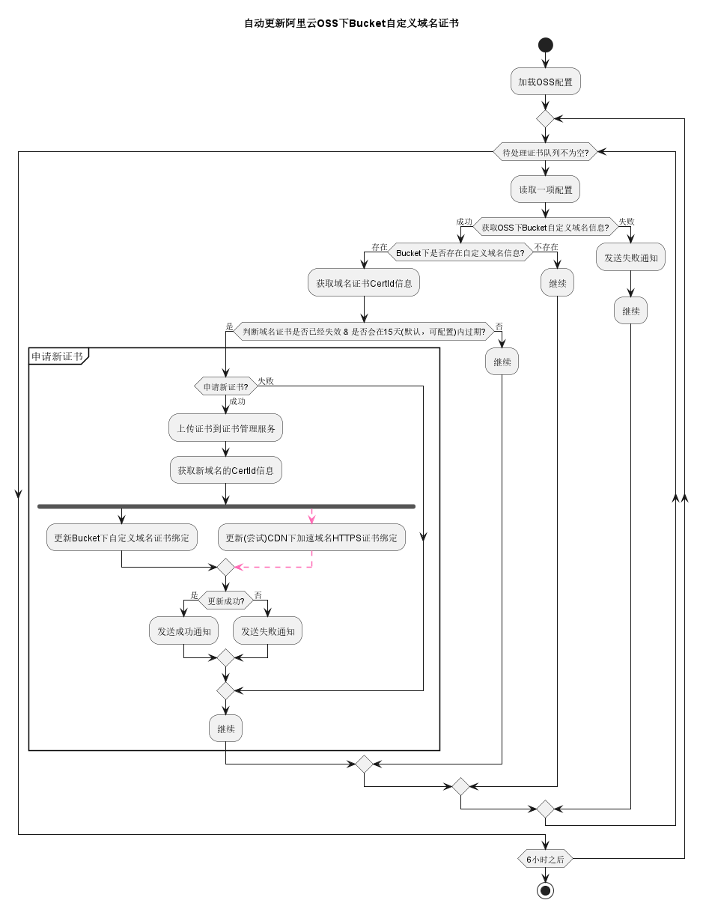

# 阿里云OSS证书自动化工具

阿里云OSS自定义域名证书自动更新工具。

## 原理

借助于 Let's Encrypt 证书，使用阿里云OSS对象存储API、阿里云证书管理服务API和阿里云CDN API实现阿里云OSS自定义域名证书的自动更新

证书更新目标资源：

- 阿里云OSS

- 阿里云CDN (加速OSS)

- 阿里云证书管理服务 (上传证书保存)



## 使用

### 配置说明

- 完整yaml配置示例:

```yaml
# 消息通知webhook地址
webhook: https://qyapi.weixin.qq.com/cgi-bin/webhook/send?key=xxxxxx-xxxxx-xxxxx-xxxxxx-xxxxxxx
### 消息通知webhook请求体模版，定义webhook请求体的格式
### 默认使用企业微信机器人的text消息格式，如下：
### 企业微信机器人文本消息示例配置：
### 参考文档：https://developer.work.weixin.qq.com/document/path/91770#%E6%96%87%E6%9C%AC%E7%B1%BB%E5%9E%8B
webhook-tpl: |
  {
    "msgtype": "text",
    "text": {
      "content": "{{ .Message }}"
    }
  }
# 证书申请配置
acme:
  email: 申请证书邮箱地址（可以收到域名证书相关通知）
  data-dir: 申请的证书文件保存目录（绝对路径）
  expired-early: 30 # 证书提前过期时间，单位：天（默认提前15天过期，推荐提前30天）
# 阿里云OSS配置 Bucket信息列表
buckets:
  - name: bucket名称1
    endpoint: bucket信息endpoint地址

  - name: bucket名称2
    endpoint: bucket信息endpoint地址

  - name: bucket名称3
    endpoint: bucket信息endpoint地址
```

##### 消息通知**webhook**请求体模版说明

消息通知请求体内容go模版，模版内容渲染后，作为请求体POST内容发送到`webhook`地址

消息模版默认使用的是企业微信机器人的text消息格式。

- 模版变量：Message - 表示通知内容

如何使用？

比如现在想要发送消息到钉钉机器人：

```yaml
# 消息通知webhook地址，这个时候这里需要填写**钉钉的webhook地址**
webhook: https://oapi.dingtalk.com/robot/send?access_token=566cc69da782ec******
# 钉钉机器人文本消息示例配置：
# 参考文档：https://open.dingtalk.com/document/orgapp/custom-robot-access#title-nfv-794-g71
webhook-tpl: |
  {
    "msgtype": "text",
    "text": {
      "content":"{{ .Message }}"
    }
  }

# 其他配置...
```

比如现在要发送消息到飞书机器人：

```yaml
# 消息通知webhook地址，这个时候这里需要填写**飞书的webhook地址**
webhook: https://open.feishu.cn/open-apis/bot/v2/hook/xxxxxxxxxxxxxxxxx
# 飞书机器人文本消息示例配置：
# 参考文档：https://open.feishu.cn/document/client-docs/bot-v3/add-custom-bot#756b882f
webhook-tpl: |
    {
      "msg_type": "text",
      "content": {
        "text": "{{ .Message }}"
      }
    }

# 其他配置...
```


##### 环境变量配置说明

环境变量配置优先级最高，如果同时配置了环境变量和yaml，将以环境变量为准。

- 阿里云环境变量:

  - OSS_ACCESS_KEY_ID：阿里云accessKeyID，**必须**，**只能通过环境变量设置**

  - OSS_ACCESS_KEY_SECRET：阿里云accessKeySecret，**必须**，**只能通过环境变量设置**

  - !!! 需要确保access_key/secret**有权限**访问**阿里云OSS对象存储**、**阿里云证书管理服务**和**阿里云CDN** 资源 !!!

- 证书申请相关环境变量:

  - ACME_EMAIL：申请证书邮箱地址（可以收到域名证书相关通知）

  - ACME_DATA_DIR：申请的证书文件保存目录（绝对路径）

  - ACME_EXPIRED_EARLY：证书提前过期时间，单位：天（默认提前15天过期，推荐提前30天）

- 调试模式环境变量:

  - DEBUG：调试模式，默认false
      - true - 开启调试，证书过期检测会直接为过期，使用`LEDirectoryStaging`环境申请证书
      - false - 关闭调试，证书过期检测计算具体的过期时间，使用`LEDirectoryProduction`环境申请证书

##### 运行参数配置说明

- log-level：日志级别，默认info级别

```shell
# 例子：
./oss-auto-cert -log-level=warn
```

- config：配置文件路径，指定yaml配置文件路径

```shell
# 例子：
./oss-auto-cert -config=/home/user/oss-auto-cert/config.yaml
```

### Docker部署（推荐）

最新稳定版本容器镜像:

dockerhub: `nekoimi/oss-auto-cert:latest`

ghcr.io: `ghcr.io/nekoimi/oss-auto-cert:latest`

```shell
# 运行例子:
docker run -d --rm -v $PWD/config.yaml:/etc/oss-auto-cert/config.yaml -e OSS_ACCESS_KEY_ID=xxx -e OSS_ACCESS_KEY_SECRET=xxx  ghcr.io/nekoimi/oss-auto-cert:latest
```

也可以将申请的证书持久化，默认保存位置是：`/var/lib/oss-auto-cert`，优先使用配置文件中的`acme.data-dir`配置路径

```shell
# 持久化申请的证书文件
docker run -d --rm -v $PWD/config.yaml:/etc/oss-auto-cert/config.yaml -v $PWD/certs:/var/lib/oss-auto-cert -e OSS_ACCESS_KEY_ID=xxx -e OSS_ACCESS_KEY_SECRET=xxx ghcr.io/nekoimi/oss-auto-cert:latest
```

- docker-compose 配置

```yaml
version: "3.8"
services:
  oss-auto-cert:
    image: ghcr.io/nekoimi/oss-auto-cert:latest
    container_name: oss-auto-cert
    hostname: oss-auto-cert
    network_mode: host
    command:
      - -log-level=warn
    volumes:
      - $PWD/config.yaml:/etc/oss-auto-cert/config.yaml
      - $PWD/certs:/var/lib/oss-auto-cert
    restart: unless-stopped
    environment:
      OSS_ACCESS_KEY_ID: xxx
      OSS_ACCESS_KEY_SECRET: xxx
      ACME_EMAIL: xxxxx@xxxxxx.com
      ACME_DATA_DIR: /data
      ACME_EXPIRED_EARLY: 30

```

### Systemd部署

- 下载最新版本：[`release`](https://github.com/nekoimi/oss-auto-cert/releases)

- 创建配置文件：`/etc/oss-auto-cert/config.yaml`

- 创建service配置: `oss-auto-cert.service`，保存路径：`/usr/lib/systemd/system`

```html
[Unit]
Description=阿里云OSS证书自动化工具
Documentation=https://github.com/nekoimi/oss-auto-cert
After=network.target local-fs.target

[Service]
Type=simple
ExecStart=/usr/bin/oss-auto-cert > /var/log/oss-auto-cert.log 2>&1
ExecStop=kill -9 $(pidof oss-auto-cert)
ExecReload=kill -9 $(pidof oss-auto-cert) && /usr/bin/oss-auto-cert > /var/log/oss-auto-cert.log 2>&1
Restart=always
RestartSec=10

[Install]
WantedBy=multi-user.target
```

- 开启

```shell
systemctl enable oss-auto-cert

systemctl start oss-auto-cert
```

- 停止

```shell
systemctl stop oss-auto-cert
```

## 感谢

- [go-acme/lego](https://github.com/go-acme/lego)
- [阿里云OpenAPI](https://api.aliyun.com)

## License

[LICENSE](LICENSE)
